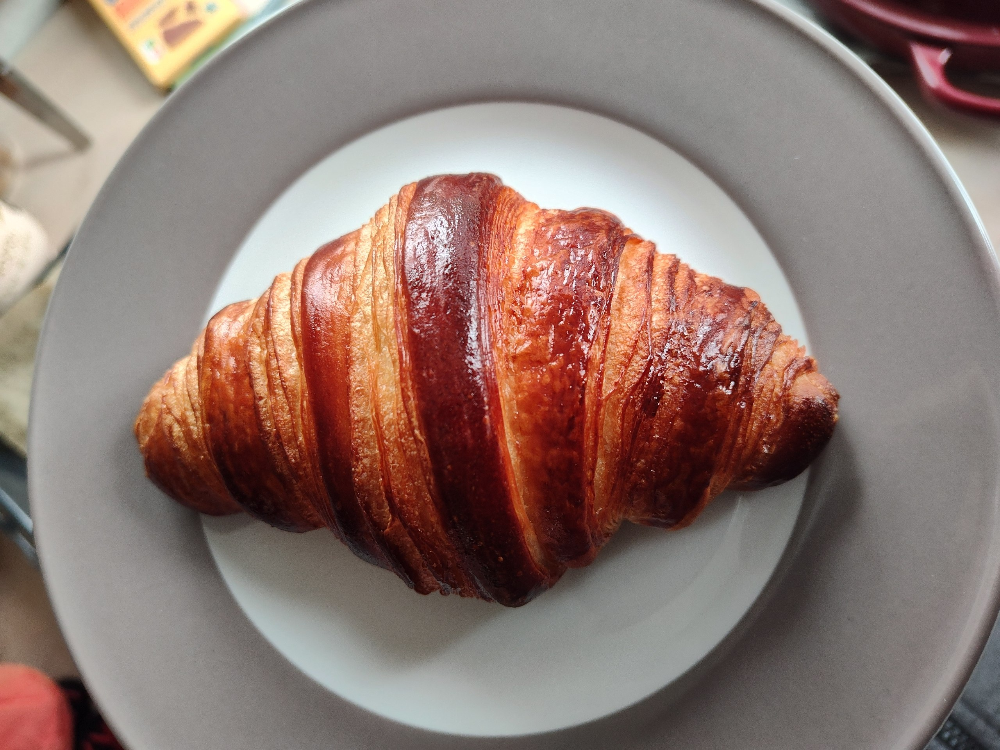

# Croissants

 

## Table of Contents
- [Table of Contents](#table-of-contents)
- [General Remarks](#general-remarks)
  - [Flour](#flour)
  - [Butter](#butter)
  - [Ingredients (for 12 croissants)](#ingredients-for-12-croissants)
  - [Tools](#tools)
- [Recipe](#recipe)
  - [Day 1: Making Poolish](#day-1-making-poolish)
  - [Day 2: Preparing Dough and Butter](#day-2-preparing-dough-and-butter)
    - [Dough](#dough)
      - [Ingredients:](#ingredients)
      - [Steps:](#steps)
    - [Butter Sheet](#butter-sheet)
      - [Ingredients:](#ingredients-1)
      - [Steps:](#steps-1)
  - [Day 3 (Laminating, Rolling, Proofing, and Baking):](#day-3-laminating-rolling-proofing-and-baking)
    - [1. Laminating](#1-laminating)
    - [2. Rolling](#2-rolling)
    - [3. Final Proofing](#3-final-proofing)
    - [4. Egg Wash](#4-egg-wash)
    - [5. Baking](#5-baking)
- [Things to Try in the Future](#things-to-try-in-the-future)
- [Useful Links](#useful-links)

## General Remarks 
### Flour
This recipe uses very strong wheat flour (type 405, type 00, or equivalent), with 12-13g of protein. The amount of protein indicates the amount of gluten. Gluten makes the dough strong, which is very important, because the buttery croissant dough is very heavy. Without a strong dough it will not rise well. You can of course experiment with using type 550 / type 1 flour for different taste.

### Butter
It is best to use butter with less water content for laminating dough, as it leaks less and is therefore better for lamination. Normal butter has 18% of water, we want to ideally use a butter with 16% water. If you can find butter sheets instead of blocks, use them. I have never found it, so my recipe uses butter blocks.

### Ingredients (for 12 croissants)
- 500g wheat flour (type 405, type 00, or equivalent)
- 155g water
- 115g milk
- 250g block butter (16% water)
- 20g extra butter (for the dough)
- 5g dry yeast (for the poolish)
- 10g fresh yeast
- 50g sugar
- 10g salt
  
### Tools
- Dough mixer
- Precise scale
- Baking papers
- 2 Baking sheets
- Plastic wrap
- Dough roller (preferably with spacers)
- Knife (preferably sharp as it reduces stress on the dough)
- Board (for carefully moving the dough)
- Thermometer
- Closable box (for poolish)
- Bowl or pot for hot water
- Pen
- Ruler or measuring tape
- Baking brush
- Fine sieve (optional)
- Whisk (optional)

# Recipe
## Day 1: Making Poolish
Poolish is a liquid pre-ferment. It improves the stability of the dough which leads to an airier dough and enhances the flavor. The yeast and honey amounts do not have to be very exact and are always the same, independent of the total amount of poolish. 
- Ingredients:
  - 5g dry yeast
  - 5g honey
  - 100g water
  - 100g flour
  
- Steps:
   1. Use the closable box. Dissolve dry yeast and honey in the water.
   2. Mix in the flour for a minute until everything is uniform.
   3. Store closed in fridge for 16-24h.

## Day 2: Preparing Dough and Butter
### Dough
#### Ingredients:
- 55g water
- 10g fresh yeast
- 115g milk
- 20g butter
- 50g sugar
- 400g flour
- 10g salt

#### Steps:
1. Dissolve fresh yeast in the water and add milk. The milk contains lactose, which is not fermentable by the yeast, and therefore caramelizes in the oven.  
2. Add butter, flour, and sugar. 
3. Add the salt last. The flour between the yeast helps prevent direct contact, which can inhibit yeast activity.
   yeast from losing its effectiveness.
1. Mix about 5 min on very slow speed to incorporate everything, then 3 min on
   a little higher speed. It is crucial to not over-mix the dough for two
   reasons. First, the mixing warms up the dough due to friction. It is very
   important that the dough does not get too hot (>28°C) as it would destroy
   the gluten structure. Second, the dough will be folded later. If the gluten
   structure would be already developed to the maximum it can rip during the
   folding. Every dough mixer is different, so base the timings on texture and
   temperature, not exact values. Do so-called window tests in between
   to find the moment when the gluten structure is well developed and stop
   then.
2. Form a dough ball. Slightly cut a cross in the top so the dough opens more easily into a rectangle later. Cover it and let it rest for about
   20 min to give it time to relax.
3. Slightly dust the table with flour. Roll out the dough to a 30x20cm rectangle.
4. Place it on baking paper, plastic wrap it, and store it in fridge for about 10-12h.
   
### Butter Sheet
#### Ingredients:
- 250g butter block (16% water)

#### Steps:
1. Mark 20x15cm rectangle on baking paper and flip it, so the markings are on the bottom
2. Place butter block on the baking paper and slap it with the rolling pin. Roll it until it begins to spread. 
3. Fold the baking paper at the markings and wrap the butter. Flip it over.
4. Roll out the butter until it is a uniform sheet and all edges are filled. 
5. Store in fridge.

## Day 3 (Laminating, Rolling, Proofing, and Baking):
### 1. Laminating
We use 1 `book fold` and 1 `letter fold`. This produces 13 dough layers (see [Laminated Dough Calculator](https://observablehq.com/@mourner/laminated-dough-calculator)). Other popular combinations are: 1 `book fold` and 2 `single folds` (17 dough layers) or 3 `letter folds` (28 dough layers). The more layers, the finer the inner structure of the croissant. But it comes with the risk of layers sticking together. 

1. Take the butter out of the fridge first. Check the consistency of the butter and the dough. It is crucial that it is similar, so that the butter does not rip and stretches evenly within the laminate. Continue if it is similar.
2. Slightly dust the table with flour. Unwrap the dough, place it on the table, and make sure that it still has the 30x20cm shape. We make a `dough-butter-sandwich` now. Unwrap the butter and place it on the middle of the dough, so that the the 20cm side align. On both sides of the butter sheet should be 7.5cm dough looking out. Cut this extending dough exactly at the edge of the butter. Flip it onto the butter so that the cut sides meet in the middle. Close the gap and slightly press the side in the middle together. Keep the wraps, because they are needed throughout the whole process. 
3. Slightly dust the top of the dough, wipe off excess flour. Now roll out the dough along the direction of the closed cut to not pull the edges apart again. Just press slightly. Make sure the butter stretches evenly with the dough. If the dough starts to stick, slightly dust the top or the table again.
4. Stop when the dough reaches a length of 64cm. Cut the uneven ends. 
5. Now we make the so-called `offset book fold`: Fold one of the cut sides only about 15 cm. Fold the other edge onto the dough, so the cut sides meet again, off-centered. Optionally reuse the cut dough from the last step in between the closing sides. Fold the whole thing in half again. Cut the bent edges, that were caused by the folding, with a sharp knife. That produces a more even lamination.
6. Wrap the dough and put it in the freezer for about 15 min to cool down again. The cooling times should be based on texture, not exact values. <!-- TODO Provide reasoning -->
7. Get the dough out and unwrap it. slightly dust the table and the dough top. Roll it out toward the long side until it reaches 61cm. Cut the edges to make them straight. 
8. Now we make the `letter fold`: Fold one third of the dough onto the middle third. Now fold the remaining third on the already folded dough. In the end the dough layers should be tripled and all sides aligned. Cut the introduced bend edges with a sharp knife.
9. Wrap it and put it into the freezer for 20 min.
10.  Unwrap and dust it again. Roll out toward the long side until it reaches 28cm. Rotate the dough 90 degrees. Roll out until it reaches 60cm. Cut the side straight. 
11.  Mark on both long sides every 10cm with a small knife cut. Cut between the markings to get 6 long rectangles. Cut the rectangles diagonally to get long triangles. Optionally, make a 1cm cut in the middle of the small edge and. That leads to longer and crunchier croissant tips.

### 2. Rolling
1. Now it is time to roll the croissants. Make sure to remove all excess flour, so that the dough can stick on itself. 
2. Slightly stretch the 2/3 thinner part of the triangle so it extents about 25%. If you made the small cut in the middle of the small edge, pull it slightly apart before rolling.
3. Start rolling from the small edge, pressing firmly. It is important that the rolled dough does not have gaps to get an even inner structure. Get lighter toward the end of the roll. The tip should be slightly underneath the croissant, so that it stays in place. Press down a bit to make it stick to the roll. The croissant should ideally have 7 segments. 
1. Place the rolled croissant on fresh baking paper on a baking sheet. Place them far enough apart and 45 degrees angled, they will double in size. 
2. Repeat steps 3. and 4. for all triangles. 

### 3. Final Proofing
The croissants should proof for about 2-3h in about 70% humidity. We use an oven for that. Alternatively you can spray them with water and proof them under plastic wrap, it will just take a little longer. Be careful while removing the plastic wrap.

1. Boil some water and put it into the pot/bowl. Add a bit cold water and place it on the bottom of your cold oven.
2. Place the baking sheets above the warm water. Use the thermometer to control the temperature. It must not exceed 30°C as this would melt the butter and ruins the lamination. Between 25-29 is a good range. Be careful with the croissants that are directly above the water, it tends to get a bit warmer there. If you notice butter leaking, directly open the door and cool the oven down a bit. To proof the croissants evenly, you can switch the baking sheets after a while. Check the temperature frequently and add more hot water or open the oven door to regulate it. 
3. Prepare the egg wash in the meantime [See ]
4. The croissants are ready when they doubled in size, look puffy, and wobble slightly if you shake the sheet. Take them out carefully. Do not move them anymore, they are very sensitive now. Directly pre-heat the oven to 200°C with fan on.
     
### 4. Egg Wash
1. Mix 2 eggs, 1 egg yolk, a pinch of salt and optionally a sip of milk until it is an even mass. 
2. Optionally filter it through the sieve to make it even finer.
2. Carefully spread the egg wash on the croissants. You can spread it to taste only on the top facing parts or also on the sides.
    
### 5. Baking
1. When the oven reached 200°C, put the croissants in, preferably one sheet at a time.
2. Bake for around 15 min. Check them frequently. As the color gives a wrong impression through the oven glass, briefly open the door to have a better look. 
3. Get the croissant out, when they become a dark golden color. 
4. ENJOY!

# Things to Try in the Future
- Adding sourdough for more flavor and even better rising
- Different oven temperature (e. g. 200°C without fan), baking colder towards the end
- Steaming 

# Useful Links
- https://observablehq.com/@mourner/laminated-dough-calculator (Laminated dough calculator)
- https://www.youtube.com/watch?v=G5ScLaxpjII (Boulangerie pas a pas, croissant recipe)
- https://www.youtube.com/watch?v=NLJZLrEM-bk (Croissant Masterclass with Scott Megee)
- https://www.youtube.com/watch?v=ITjYq18zlwA&list=PLURsDaOr8hWVg1jqcuf-XnejIMZp_eNxv (Alex "French Guy Cooking" season on croissants, especially episode 3)
- https://www.youtube.com/watch?v=2iWlBthXYZw (Croissant Troubleshooting)
- https://www.youtube.com/watch?v=3jfVJjadxi8 (SWR, german)
- https://www.youtube.com/watch?v=vpwY3nmLLaA (Make Perfect Croissants With Claire Saffitz)
